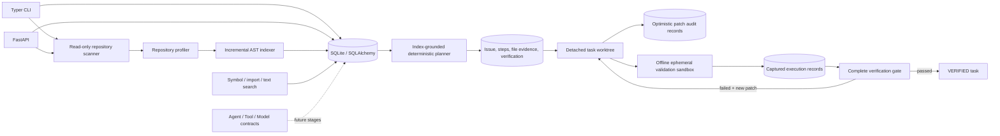

# Forge architecture through Phase 6

Forge is a modular monolith. The API and CLI share SQLAlchemy models, safe repository intelligence
services, deterministic planning, and typed contracts. SQLite persists repository identities,
profiles, indexed files, symbols, imports, task requests, plans, workspaces, patch audits, sandbox
results, and complete verification attempts. A task receives a trace ID at creation.

## Phase 1 acceptance criteria

1. A local Git repository root can be registered through the API and CLI; duplicate registration returns the same record.
2. A task can be created only for a registered repository and remains `PENDING` with a trace ID.
3. Repository and task records can be retrieved; `/health` returns service liveness.
4. Agent, tool, model provider, scanner, indexer, planner, patch manager, sandbox executor, and verifier contracts are typed and importable.
5. No repository content is executed or sent to a model. No Git hooks run.
6. Formatting, linting, type checking, and tests pass.

## Interfaces and boundaries

- `BaseAgent` accepts an `AgentContext` and returns an `AgentResult`. It declares allowed tools and retry/timeout settings; there is no scheduler yet.
- `Tool` accepts structured arguments; `ToolRegistry` only registers and retrieves tools. Policy enforcement belongs to future invocation and sandbox layers.
- `ModelProvider` is vendor neutral and has no implementation or configured credentials.
- `RepositoryScanner` validates repository identity. `RepositoryProfiler` detects technology and layout using bounded file reads.
- `LanguageAdapter` isolates Python AST parsing so later languages can supply their own parsers.
- `SqlRepositoryIndexer` uses SHA-256 hashes to parse only new and changed Python files and removes deleted-file records.
- `RepositorySearch` queries definitions, imports, dependents, and bounded source text.
- `IndexGroundedTaskPlanner` implements the planner contract without a model. It ranks indexed
  paths, symbols, imports, and import dependents and records its evidence. `SandboxExecutor` and
  `Verifier` remain protocols only.
- `GitWorktreeManager` creates a detached, no-checkout worktree and materializes committed blobs
  without invoking repository hooks or filters. `AuditedPatchManager` constrains mutations to that
  workspace and enforces expected content hashes.
- `BubblewrapSandboxExecutor` implements the sandbox contract for trusted Python entrypoints. API
  and CLI policy allow only exact verification commands from the persisted plan.
- `GateVerifier` implements the verifier contract. A complete pass moves a task to `VERIFIED`; a
  bounded chain of changed-but-failing repairs eventually moves it to `BLOCKED`.

## Storage

`repositories` stores canonical path and name. `repository_profiles` stores deterministic JSON
profiles. `indexed_files` stores relative paths, hashes, language, size, and parse failures.
`code_symbols` and `import_records` store AST results. `engineering_tasks` stores objective, type,
status, repository ID, trace ID, and creation time. `task_plans` stores the structured plan and an
index-context fingerprint. `task_workspaces` records the isolated path and base commit;
`patch_records` stores mutation paths, operations, reasons, and hashes without source content. The
`execution_records` stores command arguments, lifecycle, bounded output, exit status, duration, and
timeout/truncation flags. `verification_attempts` and `verification_execution_records` store gate
outcomes, patch-state fingerprints, repair budgets, and ordered execution evidence. The current
`create_all` bootstrap requires replacement with migrations before production use.

## Security scope

The scanner resolves a local directory and checks its `.git` marker without executing Git or repository code. Traversal does not follow symlinks, skips binary and oversized files, excludes dependency/build metadata directories, and enforces a file-count limit. Registration exposes local path metadata, so the API should bind only to a trusted local interface until authentication and authorization exist. Logs emit IDs and event names only.
