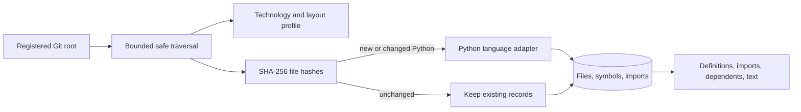

# Repository intelligence

Phase 2 turns a registered local Git repository into a small, queryable representation without running its code.

## Profile

The profiler detects languages by extension and recognizes common manifest/configuration files. For Python it detects FastAPI, Django, Flask, pytest, Ruff, mypy, Pyright, package managers, source/test directories, entry points, and CI configuration. Commands are reported only when supported by detected configuration; they are never executed.

## Incremental index

Each admitted Python file receives a SHA-256 content hash. Unchanged hashes retain existing AST records. Changed files replace their symbols and imports. Deleted files and their related records are removed. Syntax and UTF-8 errors are stored on the file record and do not abort the repository update.

Definitions include class, function, async function, nested qualified name, line range, signature, and docstring. Imports record module, imported name, relative level, and line.

## Query behavior

Symbol and import queries are case-insensitive substring searches with bounded result counts. Dependency queries return files importing a requested module or child module. Text search reads only files in the current index, checks that their sizes still match the indexed size, remains inside the repository root, and truncates returned lines.

## Phase 2 scope

Python uses the standard `ast` module. Tree-sitter, reference resolution, call graphs, embeddings, semantic search, model retrieval, planning, editing, and command execution remain later work.
